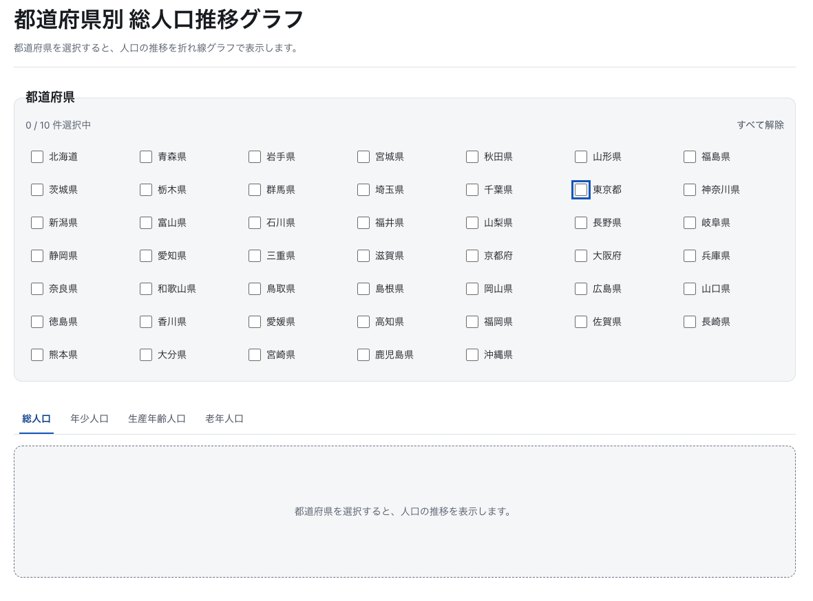

# 都道府県別人口推移グラフ

## 概要
株式会社アクセンチュア フロントエンドコーディング試験の提出物。
都道府県を選ぶと、人口の推移を折れ線グラフで表示する SPA。

## デモ
https://yumemi-frontend-codecheck-takashima.vercel.app/

## スクリーンショット



## 主な機能

- 都道府県一覧をAPIから取得し、チェックボックスとして動的に生成
- チェックした都道府県の人口構成を取得し、折れ線グラフを動的に描画（X 軸 = 年度 / Y 軸 = 人口数）
- **総人口 / 年少人口 / 生産年齢人口 / 老年人口** をタブで切り替え
- 選択状態を URL のクエリに持つため、そのまま共有・リロードできる
- スマートフォン / タブレット / デスクトップに対応


## 技術スタックと選定理由

| 分類           | 採用                                   | 理由                                                                                                                                                 |
| -------------- | -------------------------------------- | ---------------------------------------------------------------------------------------------------------------------------------------------------- |
| フレームワーク | **Next.js 16.3.4**（App Router）       | 課題の必須要件が React。加えて **API キーをブラウザに出さないためにサーバー側の実行環境が要る**。Route Handler でその置き場所が標準で手に入る        |
| 言語           | **TypeScript 5**                       | 課題の必須要件。上流 API のレスポンス型を zod から導出し、形状の変化を型エラーとして受け取る                                                         |
| グラフ         | **Recharts 3.10**                      | 課題がサードパーティ製ライブラリを要求。React コンポーネントとして書けるため、DOM を直接触る層を持ち込まずに済む。SVG 出力なので拡大しても劣化しない |
| スタイル       | **CSS Modules**                        | 課題が「スタイルは自前で記述」を要求するため UI フレームワークは使わない。Next.js に組み込みで、クラス名の衝突も防げる                               |
| データ取得     | **TanStack Query 5**                   | 都道府県ごとに並列リクエストが走る。`useQueries` で「一部だけ失敗した」状態を素直に表現でき、キャッシュ・再試行・読み込み状態を自前で書かずに済む    |
| スキーマ検証   | **zod 4**                              | 外部 API のレスポンスを信用せず境界で検証する。`z.infer` でアプリ側の型を導出し、検証と型を一箇所に寄せる                                            |
| テスト         | **Vitest 5 + Testing Library + MSW 2** | Vite ベースで既存のビルド設定を共有できる。MSW は fetch を差し替えず HTTP 層でモックするため、本番と同じコードパスを通せる                           |
| カタログ       | **Storybook 10.6**                     | コンポーネントの状態（読み込み中・エラー・上限到達）を一覧できる。`@storybook/addon-a11y` でアクセシビリティ違反も検出する                           |
| 品質           | ESLint 9 / Stylelint 17 / Prettier 3   | 課題の必須要件。ESLint はサーバー専用モジュールの import 制限にも使っている（後述）                                                                  |

## セットアップ

### 必要なもの

- Node.js **22.19.0**（`.nvmrc` に記載）
- npm
- コーディング試験 API の API キー

```bash
nvm use          # .nvmrc の 22.19.0 を使う
npm ci
```


## アーキテクチャ

### API キーをブラウザに出さないための三層

課題の「実際の API を使用する開発を想定する」という条件を、**API キーをブラウザのバンドルに含めない**と解釈した。上流 API を直接叩かず、自前のサーバー（BFF）を挟む。

```
ブラウザ                                サーバー（Next.js）              上流
─────────────────────────────────────────────────────────────────────────────
components / hooks
  └ features/population/api.ts
      └ shared/api/client/fetchJson.ts       ← /api/ 以外の URL を実行時に拒否
            │
            │  HTTP（同一オリジンのみ）
            ▼
                            app/api/prefectures/route.ts
                            app/api/population/route.ts
                              └ app/api/_lib/errorResponse.ts
                              └ features/population/server/yumemiApi.ts
                                    │  ← YUMEMI_API_KEY を読む唯一の場所
                                    │     先頭で import 'server-only'
                                    ▼
                                        frontend-engineer-codecheck-api
                                          .mirai.yumemi.io
```

この境界は 3 つの仕組みで守っている。

1. **`import 'server-only'`** — `yumemiApi.ts` の先頭に置く。クライアントコンポーネントから import されるとビルドが失敗する
2. **ESLint の `no-restricted-imports`** — `@/features/*/server/**` を import してよいのは `src/app/api/**` と `src/features/*/server/**` だけ（`eslint.config.mjs`）。ここを触るときは設定側も合わせて更新する
3. **CSP の `connect-src 'self'`** — 仮にクライアント側に外部オリジンへの fetch を書いても、ブラウザが実行時に遮断する（`next.config.ts`）

加えて `fetchJson` は `/api/` で始まる相対パス以外を実行時に拒否する。

### BFF のエンドポイント

| メソッド | パス                               | 返すもの                            |
| -------- | ---------------------------------- | ----------------------------------- |
| GET      | `/api/prefectures`                 | `{ result: Prefecture[] }`          |
| GET      | `/api/population?prefCode=<1..47>` | `{ result: PopulationComposition }` |

### エラーの扱い

上流の失敗を `yumemiApi.ts` の 4 つの例外クラスに正規化し、`toErrorResponse` が `{ error: { code, message } }` に変換する。

| 例外 / 状況                      | HTTP | `code`                 |
| -------------------------------- | ---- | ---------------------- |
| `MissingApiKeyError`             | 503  | `UPSTREAM_UNAVAILABLE` |
| `UpstreamUnreachableError`       | 503  | `UPSTREAM_UNAVAILABLE` |
| `UpstreamSchemaError`            | 502  | `UPSTREAM_ERROR`       |
| `UpstreamApiError`               | 502  | `UPSTREAM_ERROR`       |
| `prefCode` が 1〜47 の整数でない | 400  | `INVALID_PREF_CODE`    |
| それ以外                         | 500  | `INTERNAL_ERROR`       |

**クライアントに返す文言は常に定型**にして、内部事情（上流の URL・ステータス・スキーマの差分）を漏らさない。詳細は `console.error` にだけ出す。

### キャッシュ

二段構え。

|              | Route Handler の `fetch`       | レスポンスの `Cache-Control`                    |
| ------------ | ------------------------------ | ----------------------------------------------- |
| 都道府県一覧 | `revalidate: 86400`（24 時間） | `s-maxage=86400, stale-while-revalidate=604800` |
| 人口構成     | `revalidate: 3600`（1 時間）   | `s-maxage=3600, stale-while-revalidate=86400`   |

クライアント側は TanStack Query が `staleTime: Infinity` / `refetchOnWindowFocus: false`（`app/providers.tsx`）。一度取得したら再取得しない。

### レイヤー構成

```
src/
├── app/                          ルーティング・Route Handler・グローバル CSS
│   ├── api/
│   │   ├── _lib/errorResponse.ts     例外 → HTTP レスポンス
│   │   ├── population/route.ts
│   │   └── prefectures/route.ts
│   ├── error.tsx                     想定外エラーの画面
│   ├── not-found.tsx                 404 の画面
│   ├── globals.css                   デザイントークンとリセット
│   ├── layout.tsx
│   ├── page.tsx
│   └── providers.tsx                 QueryClient
│
├── features/population/           この機能のすべて
│   ├── components/                   1 ディレクトリ 4 点セット
│   │   ├── PopulationChart/          （index.tsx / *.module.css /
│   │   ├── PopulationDashboard/       *.stories.tsx / *.test.tsx）
│   │   ├── PopulationTypeTabs/
│   │   └── PrefectureSelector/
│   ├── hooks/                        useChartSelection / usePopulations / usePrefectures
│   ├── lib/                          純関数（searchParams / seriesColor / toChartSeries ほか）
│   ├── server/yumemiApi.ts           サーバー専用。API キーを読む唯一の場所
│   ├── api.ts                        BFF を叩くクライアント
│   ├── constants.ts / errors.ts / prefCode.ts / types.ts
│
├── shared/                        機能に依存しない汎用部品
│   ├── api/client/fetchJson.ts
│   ├── api/contract.ts
│   └── components/                   Button / ErrorState / Spinner
│
└── test/                          fixtures・MSW ハンドラ・テストヘルパー
```
